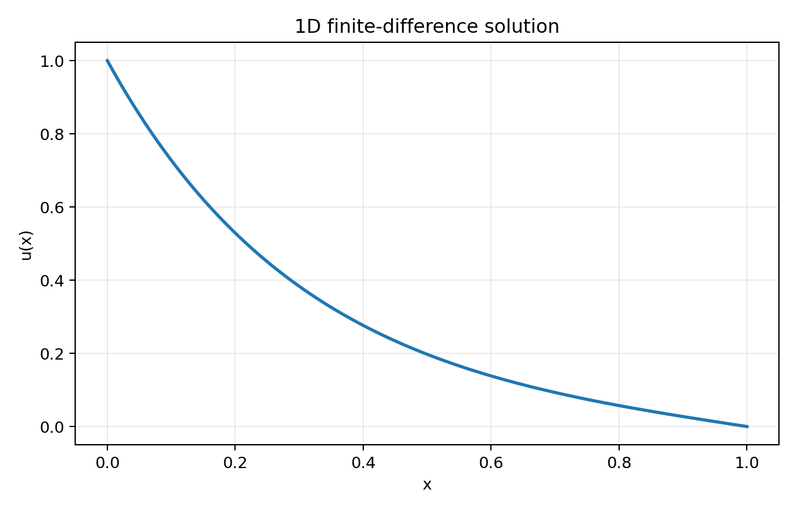
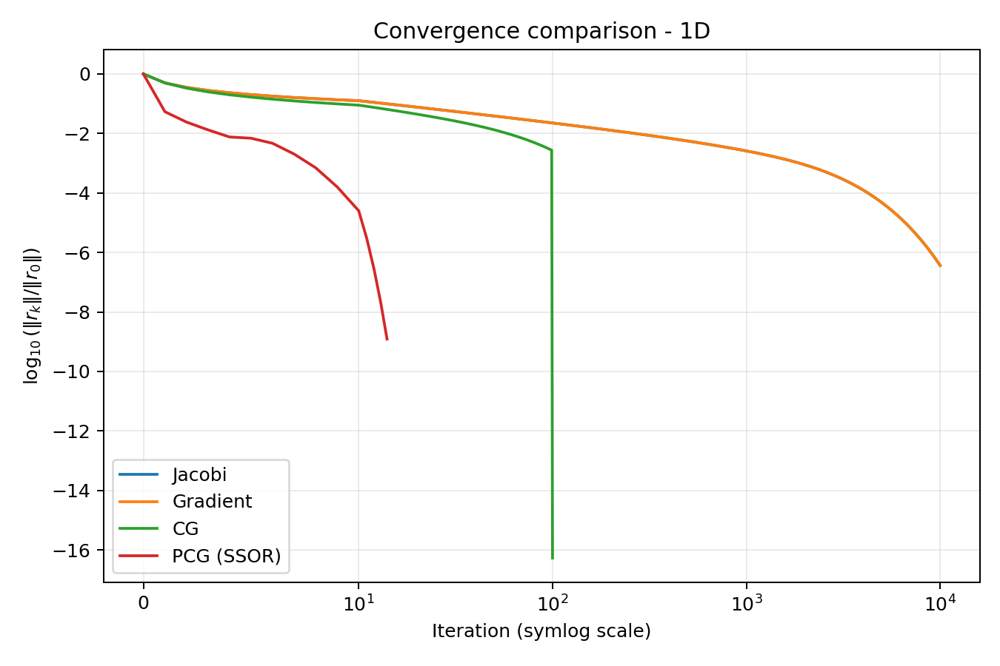
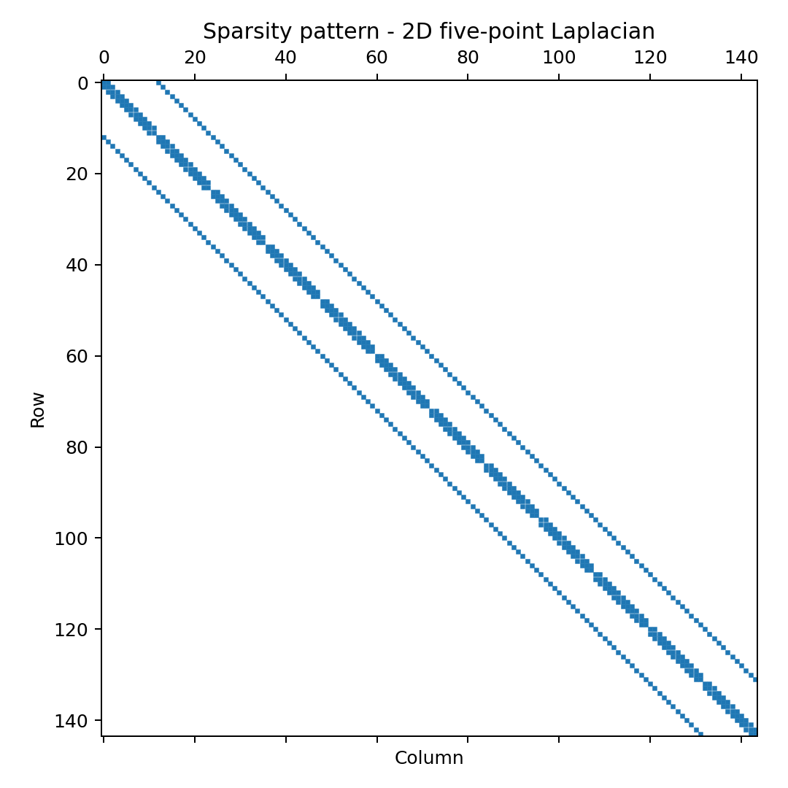
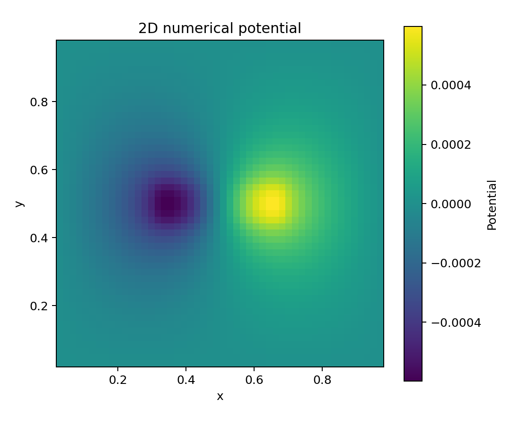
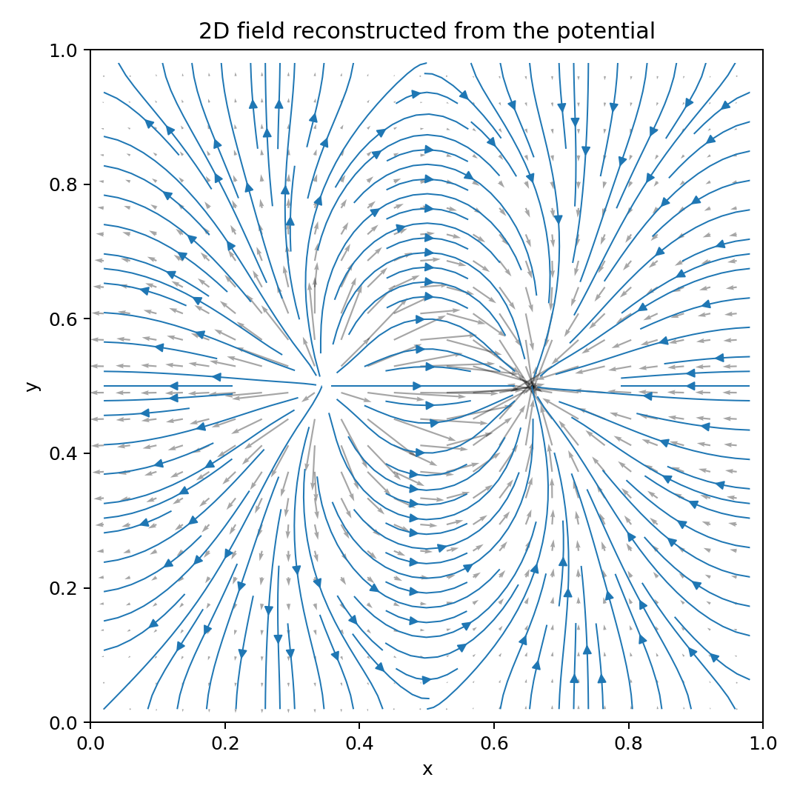
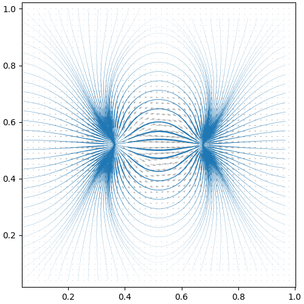
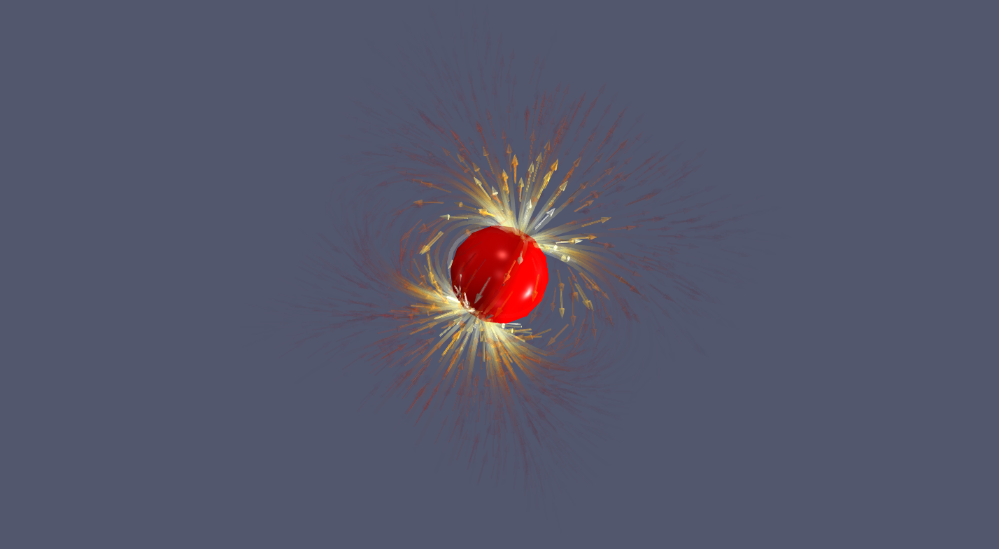
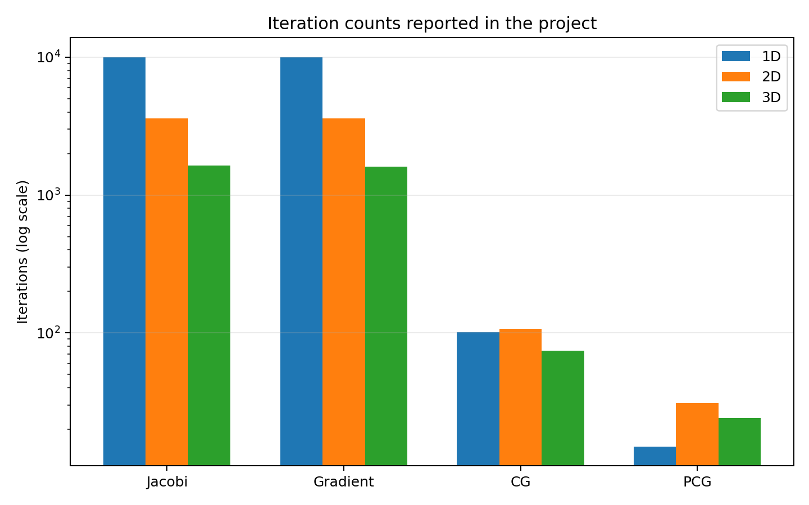

# Iterative Laplacian Solvers

Numerical solution of 1D, 2D and 3D Laplacian/Poisson-type problems using finite differences, sparse **CSR storage**, and four iterative methods: **Jacobi**, **steepest descent**, **conjugate gradient (CG)** and **preconditioned conjugate gradient (PCG)** with an **SSOR preconditioner**.

This repository is based on a GM3 Applied Mathematics project at INSA Rouen Normandie.

## Overview

The project studies the numerical problem

$$
-\Delta u + k u = f \qquad \text{in } [0,1]^d,
$$

for $d \in \{1,2,3\}$, together with Dirichlet boundary conditions. In the 1D experiment used in the project,

$$
u(0)=1, \qquad u(1)=0.
$$

Finite-difference discretization transforms the continuous problem into a sparse linear system

$$
A x = b.
$$

The objective is not only to compute the solution, but also to compare how different iterative algorithms behave as the dimension and system size increase.

## Numerical methods

The repository implements:

- **Jacobi iteration**;
- **Steepest descent**;
- **Conjugate gradient (CG)**;
- **Preconditioned conjugate gradient (PCG)**;
- **SSOR preconditioning**;
- custom **CSR matrix-vector multiplication** without relying on SciPy sparse solvers.

For a grid spacing

$$
h = \frac{1}{n+1},
$$

the 1D second derivative is approximated by

$$
u''(x_i) \approx \frac{u_{i-1}-2u_i+u_{i+1}}{h^2}.
$$

This produces the classical tridiagonal discretization in 1D, the five-point stencil in 2D, and the seven-point stencil in 3D.

## Visual results

### 1D numerical solution



### Convergence of the iterative methods



The residual criterion is based on

$$
\frac{\|r_k\|_2}{\|r_0\|_2} < \varepsilon.
$$

### Sparse matrix structure



The finite-difference Laplacian generates highly structured sparse matrices, making CSR storage substantially more appropriate than dense storage for large 2D and 3D systems.

### 2D potential and reconstructed field





The original visualization produced during the project is also preserved:



### 3D ParaView visualization

The 3D vector field is exported in VTK format for visualization with ParaView.



## Reported performance

The following iteration counts come from the academic project report. Execution times depend on hardware, so the repository emphasizes the iteration counts and convergence behavior.

| Method | 1D iterations | 2D iterations | 3D iterations |
|---|---:|---:|---:|
| Jacobi | 10000 | 3597 | 1630 |
| Gradient | 10000 | 3599 | 1611 |
| CG | 101 | 107 | 74 |
| PCG (SSOR) | **15** | **31** | **24** |



The experiments show the increasing cost of classical stationary/gradient methods as the problem grows, while CG and especially PCG reduce the number of iterations substantially.

## Repository structure

```text
iterative-laplacian-solvers/
├── src/
│   ├── csr.py                # CSR matrix representation and matvec
│   ├── discretization.py     # 1D / 2D / 3D finite-difference systems
│   ├── solvers.py            # Jacobi, gradient, CG, PCG, SSOR
│   └── visualization.py      # plots and VTK export
├── scripts/
│   └── generate_figures.py   # regenerate README figures
├── tests/
│   └── test_solvers.py
├── results/
│   ├── figures/
│   └── vtk/
├── docs/
│   └── report.pdf
├── main.py
├── Makefile
├── requirements.txt
└── README.md
```

## Installation

```bash
python3 -m venv .venv
source .venv/bin/activate
pip install -r requirements.txt
```

## Usage

Run the default 2D problem with PCG:

```bash
python3 main.py --dim 2 --method pcg
```

Examples:

```bash
# 1D with conjugate gradient
python3 main.py --dim 1 --method cg --n 100

# 2D with Jacobi
python3 main.py --dim 2 --method jacobi --n 30

# 3D with PCG and VTK export
python3 main.py --dim 3 --method pcg --n 20
```

Available methods are:

```text
jacobi
gradient
cg
pcg
```

For 3D problems, the vector field is exported to:

```text
results/vtk/field_3d.vtk
```

and can be opened with ParaView.

## Regenerate the figures

```bash
make figures
```

or

```bash
python3 scripts/generate_figures.py
```

## Tests

```bash
make test
```

The tests check matrix properties, compare the iterative solutions with a dense NumPy reference on small systems, and verify convergence of PCG on a 2D problem.

## Academic report

The complete project report is available in [`docs/report.pdf`](docs/report.pdf).

## Authors

- Manh Hung Nguyen
- Tan Minh Duy Ngo

GM3 - Applied Mathematics, INSA Rouen Normandie, 2025.
